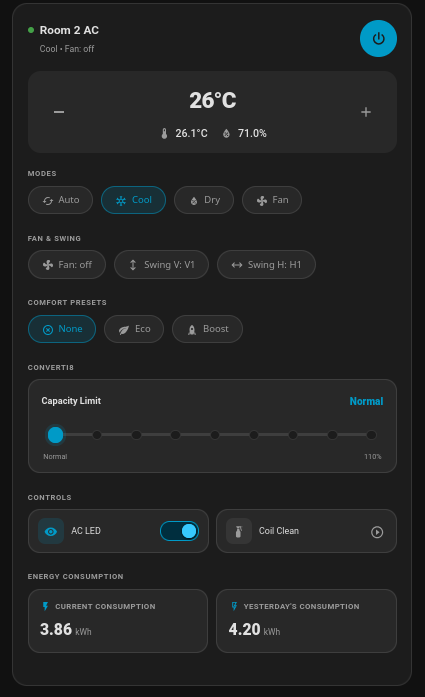

# MirAIe AC Thermostat Card (`miraie-ac-card-in`)

[](https://github.com/hacs/integration)
[](https://github.com/selvakk2k/miraie-ac-card-in/releases)

A custom Lovelace thermostat card for Panasonic Air Conditioners on the Indian market.

While designed specifically to work with the [`ha-miraie-ac-in`](https://github.com/selvakk2k/ha-miraie-ac-in) custom integration, it remains backward-compatible with the upstream [`rkzofficial/ha-miraie-ac`](https://github.com/rkzofficial/ha-miraie-ac) integration. Note: under the upstream integration, capacity controls will be limited to Converti7 (Converti8 is not supported), and features like Today's Consumption, Coil Cleaning and Filter Clean alerts will not be available as they are not exposed as entities by it.

<p align="center">
  
</p>

> [!IMPORTANT]
> This project is designed **exclusively** for Panasonic Air Conditioners that use the **MirAIe** application. It is **not compatible** with Panasonic ACs that use the global **Comfort Cloud** application.

---

## Features

* **Target & Ambient Readings**: Target temperature controls showing current ambient room temperature and humidity prominent below.
* **Stepped Capacity Slider**: A notched slider for convertible capacity limits (Normal down to 40% / up to 110%) with values displayed directly underneath. Dynamically scales between **Converti7** and **Converti8** models.
* **HVAC Mode Selection**: Selector pills for Auto, Cool, Dry, and Fan Only modes (graying out/disabling unavailable options in Dry or Fan modes).
* **Comfort Presets**: Toggle between **None**, **Eco**, and **Boost**.
* **Device Control Deck**: Toggles for the physical AC Display LED panel, Nanoe™ Air Purifier, and Coil Cleaning.
* **Energy Consumption Analytics**: Displays today's and yesterday's energy statistics. Clicking the cards launches the native Home Assistant history dialog.
* **Haptic Touch Feedback**: Triggers haptic vibration taps on supported mobile touchscreens for tactile response.
* **Responsive Layout**: Scales down padding and gaps on narrow viewports to keep controls on a single line on mobile screens.
* **Visual Editor Support**: Fully configurable directly within the Lovelace GUI editor.

---

## Installation

### Via HACS
1. In Home Assistant, open **HACS** → **Frontend** → Click the three dots (⋮) in the top-right corner.
2. Select **Custom repositories**.
3. Under **URL**, add: `https://github.com/selvakk2k/miraie-ac-card-in`
4. Select **Dashboard** as the category and click **Add**.
5. Locate the **MirAIe AC Card** in the list, click **Download**, and reload your browser dashboard.

---

## Usage & Configuration

### Using the Visual Editor
1. In your dashboard, click **Edit Dashboard** -> **+ Add Card**.
2. Search for **MirAIe AC Card**.
3. In the settings panel:
   * Select your primary `climate` entity.
   * Expand **Convertible & Controls** to link switches (Nanoe, LED) and sensors.
   * Expand **Diagnostics & Energy** to map RSSI and Energy consumption entities.

### Manual YAML Example
```yaml
type: custom:miraie-ac-card-in
entity: climate.room_2_ac
name: Bedroom AC
nanoe_switch: switch.room_2_ac_nanoe
display_switch: switch.room_2_ac_display
coil_clean_button: button.room_2_ac_start_coil_clean
coil_cleaning_sensor: binary_sensor.room_2_ac_coil_cleaning
filter_alert_sensor: binary_sensor.room_2_ac_filter_clean_alert
rssi_sensor: sensor.room_2_ac_wifi_rssi
energy_today_sensor: sensor.room_2_ac_energy_today
energy_yesterday_sensor: sensor.room_2_ac_energy_yesterday
```

---

## Credits & License

### Development Credits
* Developed with the assistance of **Claude** (Anthropic) and **Gemini/Antigravity** (Google DeepMind).

Licensed under the **MIT License**. See the `LICENSE` file for the full license text.
